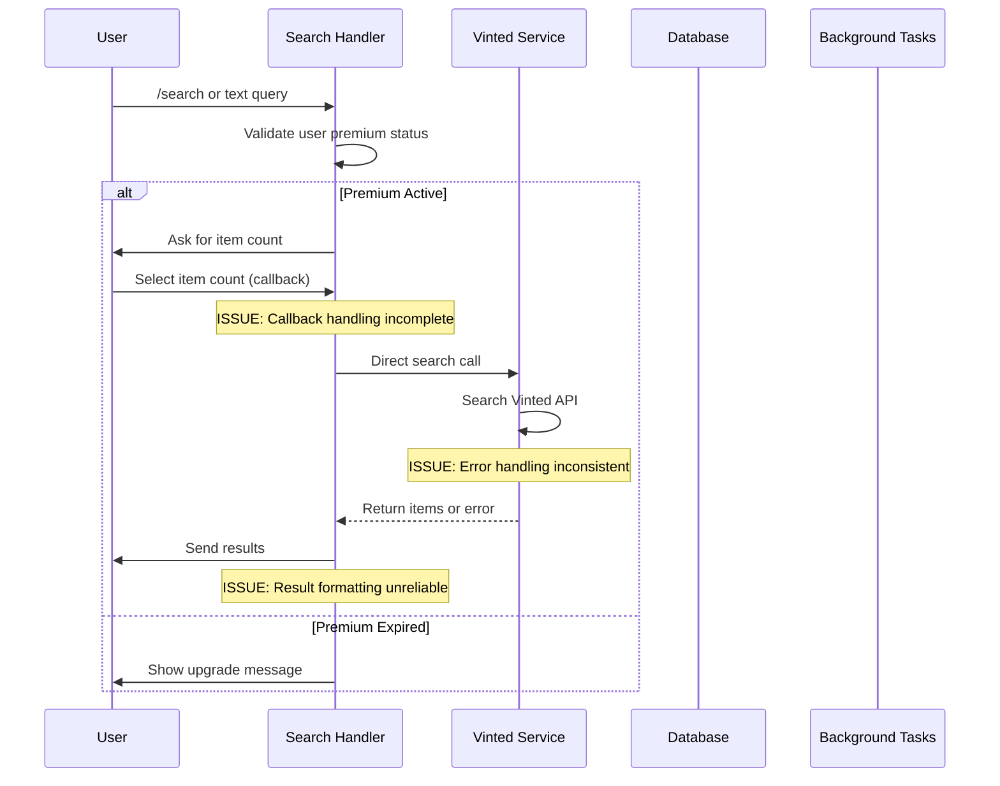

# Design Document

## Overview

The search functionality debugging and fix project addresses critical issues in the Vinted Parser Bot's search system. Based on code analysis, the main problems include incomplete callback handling, inconsistent error management, missing validation, and unreliable result formatting. This design provides a systematic approach to identify, debug, and fix these issues while maintaining backward compatibility and improving overall system reliability.

## Architecture

### Current Search Flow Analysis



### Identified Issues

1. **Callback Query Handling**: The search handler has incomplete callback query processing for item count selection
2. **Error Propagation**: Vinted API errors are not properly caught and handled in the search flow
3. **Result Formatting**: Image processing and media group creation fails silently
4. **State Management**: FSM states are not properly cleared on errors
5. **Logging**: Insufficient debugging information for troubleshooting
6. **Testing**: Missing test coverage for error scenarios

## Components and Interfaces

### Enhanced Search Handler

```python
class SearchHandler:
    """Enhanced search handler with comprehensive error handling and debugging."""
    
    async def handle_search_command(self, message: types.Message, state: FSMContext) -> None:
        """Process search command with validation and error handling."""
        
    async def handle_item_count_callback(self, callback: types.CallbackQuery, state: FSMContext) -> None:
        """Process item count selection with proper callback handling."""
        
    async def execute_search_with_monitoring(self, query: str, count: int, user_id: int) -> SearchResult:
        """Execute search with comprehensive monitoring and error handling."""
        
    async def format_and_send_results(self, bot: Bot, chat_id: int, results: list[dict]) -> None:
        """Format and send results with fallback handling for failed images."""
```

### Debugging and Monitoring Layer

```python
class SearchDebugger:
    """Debugging utilities for search functionality."""
    
    def log_search_attempt(self, user_id: int, query: str, context: dict) -> str:
        """Log search attempt with correlation ID."""
        
    def log_api_call(self, endpoint: str, params: dict, response_time: float, status: int) -> None:
        """Log API calls with timing and status information."""
        
    def log_error_with_context(self, error: Exception, context: dict) -> None:
        """Log errors with full context for debugging."""
        
    async def health_check_search_flow(self) -> dict:
        """Perform health check of entire search flow."""

class SearchMetrics:
    """Metrics collection for search functionality."""
    
    def record_search_request(self, status: str, duration: float = None) -> None:
        """Record search request metrics."""
        
    def record_api_call(self, service: str, endpoint: str, status: int, duration: float) -> None:
        """Record external API call metrics."""
        
    def record_error(self, error_type: str, component: str) -> None:
        """Record error occurrence metrics."""
```

### Enhanced Vinted Service

```python
class EnhancedVintedService:
    """Enhanced Vinted service with better error handling and debugging."""
    
    async def search_with_retry(self, query: str, max_retries: int = 3) -> SearchResult:
        """Search with exponential backoff retry logic."""
        
    async def validate_search_params(self, params: dict) -> ValidationResult:
        """Validate search parameters before API calls."""
        
    def create_circuit_breaker(self) -> CircuitBreaker:
        """Create circuit breaker for Vinted API calls."""
        
    async def get_detailed_error_info(self, error: Exception) -> ErrorInfo:
        """Extract detailed error information for debugging."""
```

### Result Formatting and Display

```python
class SearchResultFormatter:
    """Enhanced result formatting with fallback handling."""
    
    async def format_item_with_fallbacks(self, item: dict) -> FormattedItem:
        """Format item with multiple fallback strategies for images."""
        
    async def create_media_group_safe(self, images: list[str], caption: str) -> MediaGroup:
        """Create media group with error handling and fallbacks."""
        
    def create_text_only_fallback(self, item: dict) -> str:
        """Create text-only representation when images fail."""
        
    async def validate_image_urls(self, urls: list[str]) -> list[str]:
        """Validate image URLs and filter out broken ones."""
```

## Data Models

### Enhanced Error Models

```python
from enum import Enum
from dataclasses import dataclass
from typing import Optional, Dict, Any

class SearchErrorType(Enum):
    VALIDATION_ERROR = "validation_error"
    API_ERROR = "api_error"
    RATE_LIMIT_ERROR = "rate_limit_error"
    NETWORK_ERROR = "network_error"
    FORMATTING_ERROR = "formatting_error"
    STATE_ERROR = "state_error"

@dataclass
class SearchError:
    error_type: SearchErrorType
    message: str
    details: Dict[str, Any]
    correlation_id: str
    timestamp: datetime
    user_id: Optional[int] = None
    query: Optional[str] = None

@dataclass
class SearchResult:
    items: list[dict]
    total_found: int
    processing_time: float
    api_calls_made: int
    errors: list[SearchError]
    correlation_id: str
    
@dataclass
class ValidationResult:
    is_valid: bool
    errors: list[str]
    warnings: list[str]
```

### Debug Information Models

```python
@dataclass
class SearchDebugInfo:
    correlation_id: str
    user_id: int
    query: str
    start_time: datetime
    steps: list[str]
    api_calls: list[dict]
    errors: list[SearchError]
    final_status: str
    total_duration: float

@dataclass
class ComponentHealth:
    component: str
    status: str  # "healthy", "degraded", "unhealthy"
    last_check: datetime
    response_time: Optional[float]
    error_rate: Optional[float]
    details: Dict[str, Any]
```

## Error Handling

### Comprehensive Error Strategy

```python
class SearchErrorHandler:
    """Centralized error handling for search functionality."""
    
    async def handle_vinted_api_error(self, error: Exception, context: dict) -> UserResponse:
        """Handle Vinted API errors with appropriate user messaging."""
        
    async def handle_callback_error(self, callback: types.CallbackQuery, error: Exception) -> None:
        """Handle callback query errors with proper user feedback."""
        
    async def handle_formatting_error(self, item: dict, error: Exception) -> FormattedItem:
        """Handle result formatting errors with fallbacks."""
        
    def create_user_friendly_message(self, error: SearchError) -> str:
        """Create user-friendly error messages."""
```

### Circuit Breaker Implementation

```python
class VintedCircuitBreaker:
    """Circuit breaker for Vinted API calls."""
    
    def __init__(self, failure_threshold: int = 5, timeout: int = 60, success_threshold: int = 3):
        self.failure_count = 0
        self.failure_threshold = failure_threshold
        self.timeout = timeout
        self.success_threshold = success_threshold
        self.last_failure_time = None
        self.state = CircuitState.CLOSED
        self.success_count = 0
    
    async def call(self, func: Callable, *args, **kwargs) -> Any:
        """Execute function with circuit breaker protection."""
        
    def record_success(self) -> None:
        """Record successful call."""
        
    def record_failure(self) -> None:
        """Record failed call."""
```

## Testing Strategy

### Test Categories

1. **Unit Tests**: Individual component testing with mocks
2. **Integration Tests**: End-to-end search flow testing
3. **Error Scenario Tests**: Comprehensive error condition testing
4. **Performance Tests**: Load and stress testing
5. **Regression Tests**: Prevent reintroduction of fixed bugs

### Test Implementation

```python
class TestSearchDebugging:
    """Comprehensive test suite for search debugging."""
    
    async def test_callback_handling_all_scenarios(self):
        """Test all callback handling scenarios including edge cases."""
        
    async def test_error_propagation_chain(self):
        """Test error propagation through the entire search chain."""
        
    async def test_result_formatting_fallbacks(self):
        """Test result formatting with various failure scenarios."""
        
    async def test_state_management_consistency(self):
        """Test FSM state management under error conditions."""
        
    async def test_concurrent_search_handling(self):
        """Test handling of concurrent search requests."""

class TestVintedServiceErrors:
    """Test Vinted service error handling."""
    
    async def test_api_timeout_handling(self):
        """Test handling of API timeouts."""
        
    async def test_rate_limit_handling(self):
        """Test rate limit detection and handling."""
        
    async def test_malformed_response_handling(self):
        """Test handling of malformed API responses."""
        
    async def test_network_error_recovery(self):
        """Test network error recovery mechanisms."""
```

### Mock Strategies

```python
@pytest.fixture
def mock_vinted_api_with_errors():
    """Mock Vinted API with various error scenarios."""
    with respx.mock(base_url="https://www.vinted.at") as mock:
        # Success scenario
        mock.get("/api/v2/catalog/items").mock(
            return_value=httpx.Response(200, json={"items": [...]})
        )
        
        # Rate limit scenario
        mock.get("/api/v2/catalog/items").mock(
            return_value=httpx.Response(429, json={"error": "Rate limit exceeded"})
        )
        
        # Server error scenario
        mock.get("/api/v2/catalog/items").mock(
            return_value=httpx.Response(503, json={"error": "Service unavailable"})
        )
        
        yield mock

@pytest.fixture
def mock_telegram_bot_with_failures():
    """Mock Telegram bot with message sending failures."""
    bot = AsyncMock()
    
    # Simulate image sending failures
    bot.send_photo.side_effect = [
        TelegramAPIError("Image too large"),
        None,  # Success
        TelegramNetworkError("Network timeout")
    ]
    
    return bot
```

## Implementation Plan

### Phase 1: Debugging and Analysis
1. Add comprehensive logging to existing search flow
2. Implement correlation ID tracking
3. Create debugging utilities and health checks
4. Identify and document all current issues

### Phase 2: Core Fixes
1. Fix callback query handling in search handler
2. Implement proper error propagation from Vinted service
3. Add input validation and sanitization
4. Fix result formatting and image handling

### Phase 3: Enhanced Error Handling
1. Implement circuit breaker for Vinted API
2. Add retry logic with exponential backoff
3. Create user-friendly error messages
4. Implement graceful degradation

### Phase 4: Testing and Validation
1. Create comprehensive test suite
2. Add performance and load testing
3. Implement monitoring and alerting
4. Validate fixes with real user scenarios

### Phase 5: Monitoring and Observability
1. Add metrics collection for search operations
2. Create dashboards for search health monitoring
3. Implement alerting for search failures
4. Add performance monitoring and optimization

## Security Considerations

### Input Validation
- Sanitize all user search queries
- Validate callback data integrity
- Prevent injection attacks through search parameters

### Error Information Disclosure
- Ensure error messages don't expose sensitive system information
- Log detailed errors securely without exposing to users
- Implement proper error message sanitization

### Rate Limiting and Abuse Prevention
- Implement per-user search rate limiting
- Detect and prevent search abuse patterns
- Add CAPTCHA for suspicious search behavior

## Performance Optimization

### Caching Strategy
- Cache successful search results for 5 minutes
- Cache Vinted API responses to reduce external calls
- Implement intelligent cache invalidation

### Async Processing
- Maintain async processing for all search operations
- Implement proper connection pooling
- Use background tasks for heavy processing

### Resource Management
- Monitor memory usage during result processing
- Implement proper cleanup for failed operations
- Add resource limits for concurrent searches

## Monitoring and Observability

### Key Metrics
- Search success rate
- Average search response time
- Vinted API error rate
- User satisfaction metrics (completion rate)

### Alerting Rules
- Search success rate below 95%
- Average response time above 10 seconds
- Error rate above 5%
- Vinted API unavailable for more than 5 minutes

### Logging Strategy
- Structured logging with correlation IDs
- Separate log levels for debugging vs production
- Log aggregation and analysis tools
- Performance profiling for slow operations