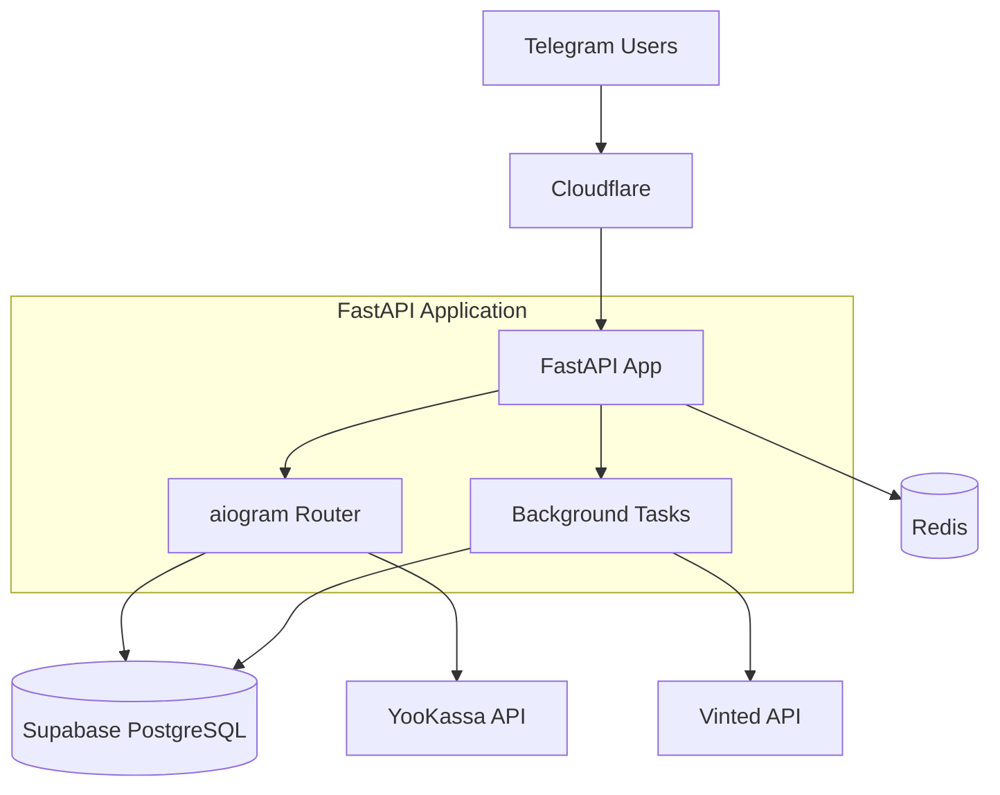

# Design Document

## Overview

The Vinted Parser Bot is a production-ready Telegram bot built with Python 3.12, aiogram 4.x, and FastAPI. It provides Austrian users with Vinted search capabilities, premium subscriptions via YooKassa, and a referral system. The architecture follows async-first principles with proper rate limiting, security, and scalability considerations.

## Architecture

### High-Level Architecture



### Technology Stack

- **Runtime**: Python 3.12 with asyncio
- **Bot Framework**: aiogram 4.x for Telegram Bot API 8.3
- **Web Framework**: FastAPI 1.4 for webhooks and health checks
- **Database**: Supabase PostgreSQL with Row Level Security
- **Cache/Queue**: Redis 6 for rate limiting and background jobs
- **HTTP Client**: httpx 0.27 with connection pooling
- **Payments**: YooKassa API integration
- **Vinted Integration**: vinted-api-wrapper 0.3.9
- **Deployment**: Docker with gunicorn + uvicorn workers

### Deployment Architecture

- **Load Balancer**: Cloudflare with DDoS protection and WAF
- **Application**: Docker containers with health checks
- **Database**: Supabase managed PostgreSQL with daily backups
- **Monitoring**: Structured logging with request tracing
- **CI/CD**: GitHub Actions with automated testing and deployment

## Components and Interfaces

### Bot Handlers

#### Start Handler (`/start`)
- Creates new users with 7-day trial
- Processes referral deep links with HMAC verification
- Awards referral bonuses (3 days) to inviters
- Prevents self-referrals and duplicate credits

#### Search Handler
- Accepts text queries from users
- Validates user trial/subscription status
- Queues background Vinted crawl jobs
- Returns immediate response with job status

#### Payment Handler (`/pay`)
- Creates YooKassa payment sessions
- Handles payment confirmations and failures
- Updates user subscription status
- Processes webhook notifications with signature verification

#### Referral Handler (`/invite`)
- Generates signed deep links with user ID
- Displays current referral statistics
- Shows trial expiration dates

### Background Services

#### Vinted Crawler Service
```python
class VintedCrawler:
    async def search_items(self, query: str, pages: int = 5) -> list[dict]
    async def fetch_item_details(self, item_ids: list[int]) -> list[dict]
    async def store_items_batch(self, items: list[dict]) -> None
```

- Uses vinted-api-wrapper with Austrian domain (country_ids=14)
- Implements rate limiting (30 req/min) with aiometer
- Handles Cloudflare blocks and 429 responses
- Batches database writes for efficiency

#### Payment Service
```python
class PaymentService:
    async def create_payment(self, user_id: int, amount: str) -> dict
    async def verify_webhook(self, payload: bytes, signature: str) -> bool
    async def process_payment_success(self, payment_id: str) -> None
```

- Integrates with YooKassa API v3
- Implements webhook signature verification
- Handles payment state transitions
- Updates user subscription status

#### Notification Service
```python
class NotificationService:
    async def send_new_items(self, user_id: int, items: list[dict]) -> None
    async def send_referral_bonus(self, referrer_id: int, invitee_name: str) -> None
    async def send_payment_confirmation(self, user_id: int, expires_at: datetime) -> None
```

### Database Layer

#### User Management
```python
class UserService:
    async def create_user(self, tg_id: int, referrer_id: int = None) -> User
    async def get_user(self, tg_id: int) -> User | None
    async def extend_trial(self, user_id: int, days: int) -> None
    async def is_premium_active(self, user_id: int) -> bool
```

#### Search Management
```python
class SearchService:
    async def save_search(self, user_id: int, query: str) -> None
    async def get_user_searches(self, user_id: int) -> list[SavedSearch]
    async def find_matching_users(self, item_keywords: list[str]) -> list[int]
```

## Data Models

### Database Schema

```sql
-- Users table
CREATE TABLE users (
    id BIGSERIAL PRIMARY KEY,
    tg_id BIGINT UNIQUE NOT NULL,
    username VARCHAR(255),
    first_name VARCHAR(255),
    joined_at TIMESTAMP DEFAULT NOW(),
    trial_expires TIMESTAMP NOT NULL,
    subscription_expires TIMESTAMP,
    referred_by BIGINT REFERENCES users(id),
    referrals_count INTEGER DEFAULT 0,
    created_at TIMESTAMP DEFAULT NOW(),
    updated_at TIMESTAMP DEFAULT NOW()
);

-- Items table
CREATE TABLE items (
    id BIGINT PRIMARY KEY,
    title VARCHAR(500) NOT NULL,
    price DECIMAL(10,2) NOT NULL,
    currency VARCHAR(3) DEFAULT 'EUR',
    brand VARCHAR(255),
    size VARCHAR(100),
    condition VARCHAR(100),
    description TEXT,
    seller_id BIGINT,
    url VARCHAR(500) NOT NULL,
    preview_img VARCHAR(500),
    ships_to_at BOOLEAN DEFAULT true,
    created_at TIMESTAMP DEFAULT NOW(),
    updated_at TIMESTAMP DEFAULT NOW()
);

-- Photos table
CREATE TABLE photos (
    id BIGSERIAL PRIMARY KEY,
    item_id BIGINT REFERENCES items(id) ON DELETE CASCADE,
    url VARCHAR(500) NOT NULL,
    order_no INTEGER DEFAULT 0,
    created_at TIMESTAMP DEFAULT NOW()
);

-- Saved searches table
CREATE TABLE saved_searches (
    id BIGSERIAL PRIMARY KEY,
    user_id BIGINT REFERENCES users(id) ON DELETE CASCADE,
    query VARCHAR(255) NOT NULL,
    filters JSONB,
    notifications_enabled BOOLEAN DEFAULT true,
    created_at TIMESTAMP DEFAULT NOW()
);

-- Referrals table
CREATE TABLE referrals (
    id BIGSERIAL PRIMARY KEY,
    inviter_id BIGINT REFERENCES users(id) ON DELETE CASCADE,
    invitee_id BIGINT REFERENCES users(id) ON DELETE CASCADE UNIQUE,
    bonus_awarded BOOLEAN DEFAULT false,
    created_at TIMESTAMP DEFAULT NOW()
);

-- Payments table
CREATE TABLE payments (
    id BIGSERIAL PRIMARY KEY,
    user_id BIGINT REFERENCES users(id) ON DELETE CASCADE,
    yookassa_id VARCHAR(255) UNIQUE NOT NULL,
    amount DECIMAL(10,2) NOT NULL,
    currency VARCHAR(3) DEFAULT 'RUB',
    status VARCHAR(50) NOT NULL,
    created_at TIMESTAMP DEFAULT NOW(),
    updated_at TIMESTAMP DEFAULT NOW()
);
```

### Pydantic Models

```python
from pydantic import BaseModel
from datetime import datetime
from typing import Optional

class User(BaseModel):
    id: int
    tg_id: int
    username: Optional[str]
    first_name: Optional[str]
    trial_expires: datetime
    subscription_expires: Optional[datetime]
    referrals_count: int = 0

class VintedItem(BaseModel):
    id: int
    title: str
    price: float
    currency: str = "EUR"
    brand: Optional[str]
    url: str
    preview_img: Optional[str]
    photos: list[str] = []

class PaymentRequest(BaseModel):
    amount: str
    description: str
    return_url: str
```

## Error Handling

### Exception Hierarchy
```python
class VintedBotError(Exception):
    """Base exception for all bot errors"""

class VintedAPIError(VintedBotError):
    """Vinted API communication errors"""

class PaymentError(VintedBotError):
    """Payment processing errors"""

class UserNotFoundError(VintedBotError):
    """User lookup errors"""

class RateLimitError(VintedBotError):
    """Rate limiting errors"""
```

### Error Response Strategy
- **User-facing errors**: Friendly messages with retry options
- **System errors**: Detailed logging with request IDs
- **Rate limits**: Exponential backoff with jitter
- **Payment failures**: Clear instructions for resolution
- **Vinted API errors**: Graceful degradation with cached results

### Circuit Breaker Pattern
```python
class VintedCircuitBreaker:
    def __init__(self, failure_threshold: int = 5, timeout: int = 60):
        self.failure_count = 0
        self.failure_threshold = failure_threshold
        self.timeout = timeout
        self.last_failure_time = None
        self.state = "CLOSED"  # CLOSED, OPEN, HALF_OPEN
```

## Testing Strategy

### Test Pyramid
- **Unit Tests (80%)**: Handler logic, data models, utilities
- **Integration Tests (15%)**: Database operations, external API mocks
- **End-to-End Tests (5%)**: Full user flows with test bot

### Test Tools
- **pytest** with asyncio support
- **aiogram-tests** for handler testing
- **respx** for HTTP mocking
- **pytest-cov** for coverage reporting (target: 90%+)

### Mock Strategy
```python
@pytest.fixture
def mock_vinted_api():
    with respx.mock(base_url="https://www.vinted.at") as mock:
        mock.get("/api/v2/catalog/items").mock(
            return_value=httpx.Response(200, json={"items": []})
        )
        yield mock

@pytest.fixture
def mock_yookassa():
    with respx.mock(base_url="https://api.yookassa.ru") as mock:
        mock.post("/v3/payments").mock(
            return_value=httpx.Response(200, json={"id": "test_payment"})
        )
        yield mock
```

### Performance Testing
- Load testing with 100 concurrent users
- Rate limit validation
- Database connection pool testing
- Memory leak detection

## Security Considerations

### Authentication & Authorization
- Telegram webhook secret verification
- YooKassa webhook HMAC signature validation
- Referral link HMAC signing with expiration
- Row Level Security (RLS) on all database tables

### Data Protection
- No storage of sensitive payment data
- GDPR compliance with data deletion endpoints
- Encrypted environment variables
- Secure session management

### Rate Limiting
```python
# Redis-based rate limiting
@rate_limit("search", max_requests=10, window=60)  # 10 searches per minute
async def handle_search(message: types.Message):
    pass

@rate_limit("payment", max_requests=3, window=300)  # 3 payments per 5 minutes
async def handle_payment(callback: types.CallbackQuery):
    pass
```

### Input Validation
- Pydantic models for all API inputs
- SQL injection prevention with parameterized queries
- XSS protection in user-generated content
- File upload restrictions and scanning

## Performance Optimization

### Caching Strategy
- Redis caching for frequent Vinted searches (TTL: 5 minutes)
- User session caching (TTL: 1 hour)
- Database query result caching for popular items

### Database Optimization
- Proper indexing on frequently queried columns
- Connection pooling with SQLAlchemy
- Read replicas for heavy search operations
- Batch operations for bulk data processing

### Async Processing
- Background job queue for Vinted crawling
- Concurrent HTTP requests with aiometer
- Database connection pooling
- Graceful shutdown handling

### Monitoring & Observability
```python
# Structured logging
logger.info(
    "search_completed",
    user_id=user.tg_id,
    query=search_query,
    results_count=len(items),
    duration_ms=duration,
    request_id=request_id
)

# Metrics collection
metrics.counter("searches_total").inc()
metrics.histogram("search_duration_seconds").observe(duration)
metrics.gauge("active_users").set(active_count)
```